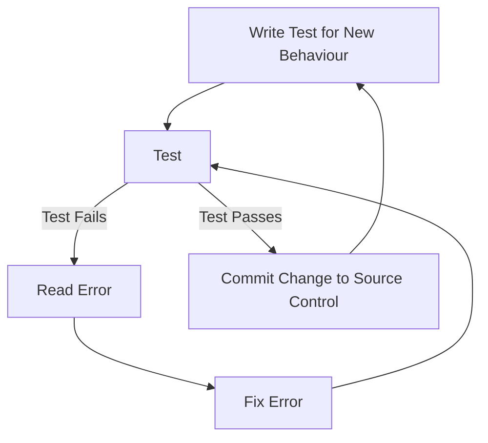

# Learn Go with Tests

***Learn Go with Tests*** is a book about learning Go following the TDD philosophy *"Red, Green, Refactor"*. I though this would be a great book for myself to work through for my [ssgo](https://www.github.com/jacoboneill/ssgo) project as I wanted to practice my TDD and Go development with that project and get this blog online.

I found the book while scrolling through TikTok and YouTube and thought I would give it a go. This is going to be a lot longer of a post than I typically do. So here is the tl;dr, otherwise enjoy!

> TODO: Add tl;dr

## Introduction

The introduction does a lot of things for the reader, it explains how the writer has tried to teach developers Go using a myriad of techniques, none of them working quite as well as they would hope. On top of this, it explains how developers are reluctant to do TDD as it adds more work (my friend who works in QA has also mentioned this). They then go on to explain how to install Go (on MacOS it is as simple as `brew install go`). They then go on to explain the tools that Go comes with (`go mod` for setting up modules, `go fmt` for formatting code). We then go on to writing some code.

## Hello, World

The infamous *Hello, World*, a developers first steps into a new language, but this time with testing in mind. They split the program up to create a function that generates the `Hello, World!` `string`, and then pass that function into `main` to print to the screen. This `Hello` function can then be tested on to make sure that the returned string is in fact `Hello, World!`. Seems pretty redundant for a test until you read on and it explains about refactoring. It states that if you have unit tests for behaviour, then it is easier to catch out mistakes when refactoring. They give this excellent example of refactoring in the introduction:

```go
import "fmt"

// Before refactoring
func Hello(name, language string) (string, error) {
    if language == "es" {
        return "Hola, " + name, nil
    } else if language == "fr" {
        return "Bonjour, " + name, nil
    } else if language == "en" {
        return "Hello, " + name, nil
    } else {
        return "", fmt.Errorf("Language not recognised: %q", language)
    }
}

// After refactoring
func HelloV2(name, language string) (string, error) {
    m := map[string]string{
        "es": "Hola",
        "fr": "Bonjour",
        "en": "Hello",
    }

    hello, ok := m[language]
    if !ok {
        return "", fmt.Errorf("Language not recognised: %q", language)
    }

    return fmt.Sprintf("%s, %s", hello, name), nil
}
```

The first maybe was created because only English was needed, then it got a feature request to use French and Spanish. What would've happened next is someone would've written tests for each of these cases, as well as the error. Then they decided to refactor using a `map` to make it easier to add more languages, as well as be able to consistently update the output without updating every language. The point is that they didn't change the behaviour when doing the refactor, so therefore the tests should still pass the same as they did before. If they don't then obviously something went wrong.

I finally wrote my [code](https://www.github.com/jacoboneill/blog/blob/main/posts/learn_go_with_tests/src/001_Hello_World/hello.go):
```go
package main

import "fmt"

func Hello() string {
    return "Hello, World!"
}

func main() {
    fmt.Println(Hello())
}
```

and [test](https://www.github.com/jacoboneill/blog/blob/main/posts/learn_go_with_tests/src/001_Hello_World/hello_test.go)
```go
package main

import "testing"

func TestHello(t *testing.T) {
    got := Hello()
    want := "Hello, World!"

    if got != want {
        t.Errorf("got %q, want %q", got, want)
    }
}
```

When I do `go test` I get:
```
> go test
PASS
ok      001_Hello_World 0.342s
```

### Hello, YOU

We then move on to doing some actual TDD. The book explains that we should write tests before we implement them in code. In this example they want us to update our `function` to take a recipient and say hello to them:
```go
package main

import "testing"

func TestHello(t *testing.T) {
    got := Hello("Jacob")
    want := "Hello, Jacob!"

    if got != want {
        return t.Errorf("got %q want %q", got, want)
    }
}
```

We then do `go test`
```
> go test
# 001_Hello_World [001_Hello_World.test]
./hello_test.go:15:15: too many arguments in call to Hello
	have (string)
	want ()
FAIL	001_Hello_World [build failed]
```

Ah, I am wanting a `string` to be a parameter, let's update the function signature in our main file:

```go
package main

import "fmt"

func Hello(name string) string {
	return "Hello, World!"
}

func main() {
	fmt.Println(Hello("Jacob"))
}
```

Let's try testing again:
```
> go test
--- FAIL: TestHello (0.00s)
    hello_test.go:19: got "Hello, World!", want "Hello, Jacob!"
FAIL
exit status 1
FAIL	001_Hello_World	0.173s
```

Ah, we are now not getting the output we want. This is because we haven't implemented the new behaviour:
```go
package main

import "fmt"

func Hello(name string) string {
	return fmt.Sprintf("Hello, %s!", name)
}

func main() {
	fmt.Println(Hello("Jacob"))
}
```

And test...:
```
> go test
PASS
ok  	001_Hello_World	0.172s
```

Perfect now it is all working. Don't worry, I am not going to write this iteration over and over again in this post, but I thought it would be useful to show what the actual workflow is meant to be:



### Hello world... again

We have a new behaviour: *When our function is called with an empty string it defaults to printing "Hello, world!" rather than "Hello, {name}".*

This time, the book introduces us to `t.Run`, a nice little command that can help organise our tests:
```go
package main

import "testing"

func TestHello(t *testing.T) {
	t.Run("saying hello to recipient", func(t *testing.T) {
		got := Hello("Jacob")
		want := "Hello, Jacob!"

		if got != want {
			t.Errorf("got %q, want %q", got, want)
		}
	})

	t.Run("saying hello with empty string", func(t *testing.T) {
		got := Hello("")
		want := "Hello, World!"

		if got != want {
			t.Errorf("got %q, want %q", got, want)
		}
	})
}
```

This tests both our case we currently have, as well as with a blank `string`. Testing it, it gives us an error saying the return for empty `string` was `Hello, !` so let's fix the implementation:
```go
package main

import "fmt"

func Hello(name string) string {
	if name == "" {
		name = "World"
	}
	return fmt.Sprintf("Hello, %s!", name)
}

func main() {
	fmt.Println(Hello("Jacob"))
}
```

Basically, I just reset the `name` variable if the input is blank to `World`, which means if we change our format string in the `return` statement, even the blank case should match. And perfect! This passes.

### Keep going! More requirements

Requirements:
- Add language and translations, default to english
    - Spanish
    - French

The book to say to use an `if-else` sequence, then refactor to a `switch` statement, but considering what we learnt above, I am going to use a `map`. First let's write our tests

```go
package main

import "testing"

func TestHello(t *testing.T) {
	t.Run("no name", func(t *testing.T) {
		got := Hello("", "en")
		want := "Hello, World!"

		if got != want {
			t.Errorf("got %q, want %q", got, want)
		}
	})

	t.Run("with name", func(t *testing.T) {
		got := Hello("Jacob", "en")
		want := "Hello, Jacob!"

		if got != want {
			t.Errorf("got %q, want %q", got, want)
		}
	})

	t.Run("in English", func(t *testing.T) {
		got := Hello("Jacob", "en")
		want := "Hello, Jacob!"

		if got != want {
			t.Errorf("got %q, want %q", got, want)
		}
	})

	t.Run("default to English", func(t *testing.T) {
		got := Hello("Jacob", " ")
		want := "Hello, Jacob!"

		if got != want {
			t.Errorf("got %q, want %q", got, want)
		}
	})

	t.Run("in Spanish", func(t *testing.T) {
		got := Hello("Jacob", "es")
		want := "Hola, Jacob!"

		if got != want {
			t.Errorf("got %q, want %q", got, want)
		}
	})

	t.Run("in French", func(t *testing.T) {
		got := Hello("Jacob", "fr")
		want := "Bonjour, Jacob!"

		if got != want {
			t.Errorf("got %q, want %q", got, want)
		}
	})
}
```

This is a pretty big code block. I would've used a case based workflow but this comes up later so I will do it the manual way for now. For implementation, I am going to comment each case until it passes. This is the equivalent of writing the test after the last one passes.

Here is my final implementation:
```go
package main

import "fmt"

var translations = map[string]string{
	"en": "Hello",
	"es": "Hola",
	"fr": "Bonjour",
}

func Hello(name, language string) string {
	if name == "" {
		name = "World"
	}

	prefix, ok := translations[language]
	if !ok {
		prefix = translations["en"]
	}

	return fmt.Sprintf("%s, %s!", prefix, name)
}
```

This uses the power of a map, while checking if there is a `translation` to get the default. This is what we mentioned above.
