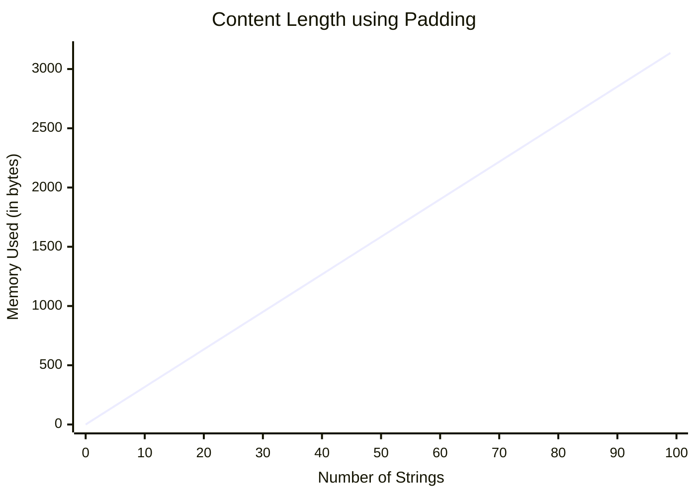
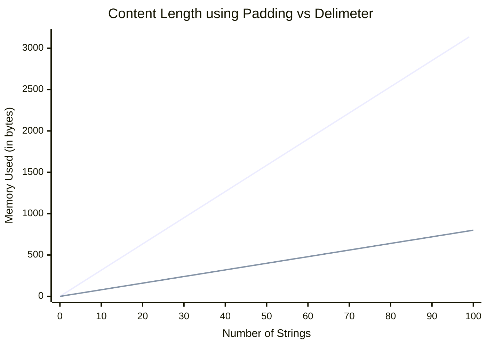

# Leetcode 271 Encode and Decode String

> Design an algorithm to encode a list of strings to a string. The encoded string is then sent over the network and is decoded back to the original list of strings.

## Understanding The Problem

Okay, so this is an interesting question. Basically it is asking us to serialise and deserialise a set of strings. The main solution most people think of is *Ah, I know something that does something like this, CSV's! I will add a delimeter between each string, and then remove the delimeter when decoding*. This has a few issues, mainly:
- Do we use a standard delimeter (like how CSV uses `,`) or do we allow the user to chose.
- How do we escape the delimeter in the string? I.e. if the input is `["Hello, ", "World"]` then this would encode to `Hello, ,World` and then decode to `["Hello", " ", "World"]` which is not what we want
- Okay, so we escape using `\`, how do we then escape the escape sequence: `["Hello\", " World"]` &rarr; `Hello\,World` &rarr; `["Hello,World"]`.

These problems, while able to overcome, are annoying, especially when there is a better solution.

## Taking Inspiration from HTTP/1.1

So in HTTP/1.1, the way they make sure that all the data is sent is by using a `Content-Length` header:

An example of an HTTP/1.1 POST request
```
POST / HTTP/1.1
Host: example.com
Content-Type: application/json
Content-Length: 15
User-Agent: curl/7.68.0
Accept: */*

{"key":"value"}
```

The point is the `Content-Length` flag with `15`. This is encoding the length of the message we are trying to send. HTTP/1.1 uses this for error checking, but I am thinking we can use this as a prefix to each string to know the length.

Luckily, our constraints say that the length of each string can be a maximum of 200 characters. So 3 characters for the length and then the message works best.

My thinking is:
```
Input: ["Hello, ", "World!"]
Encode: "007Hello, 006World!"
Decode: ["Hello, ", "World!"]
```

This is my implementation of this in Go:
```go
import (
    "fmt"
    "strconv"
    "strings"
)

func ContentLengthEncode(strs []string) string {
    var b strings.Builder

    for _, str := range strs {
        fmt.Fprintf(&b, "%03d%s", len(str), str)
    }

    return b.String()
}

func ContentLengthDecode(s string) []string {
    var strs []string

    i := 0
    for i < len(s)-1 {
        l, err := strconv.Atoi(s[i : i+3])
        if err != nil {
            return []string{}
        }

        strs = append(strs, s[i+3:i+3+l])
        i += 3 + l
    }
    
    return strs
}
```

Let's go through each function

### ContentLengthEncode

Firstly, we initiate a `strings.Builder`. This is from the `strings` builtin library:
> A Builder is used to efficiently build a string using [Builder.Write](https://pkg.go.dev/strings#Builder.Write) methods. It minimizes memory copying. The zero value is ready to use. Do not copy a non-zero Builder. 
> [\[1\]](https://pkg.go.dev/strings#Builder)

I decided to use this while I was doing research on string manipulation in Go. Most other string manipulation techniques takes the original string, copies it to memory, updates the copy, then deletes the original. This works well for a low amount of operations but after a few concatenations, using `strings.Builder` is more appropriate. As well as this, I wanted to learn how `strings.Builder` works.

Then we go through each string and use `fmt.Fprintf`. This function is simmilar to `fmt.Printf` except instead of printing the string to `stdout`, it prints it to an `io.Writer` [\[2\]](https://pkg.go.dev/fmt#Fprintf). You can actually recreate the `fmt.Printf` functionality using `fmt.Fprintf`:
```go
import (
    "fmt"
    "os"
)

func main(){
    s := "Hello, World!"
    fmt.Fprintf(os.Stdout, "%s\n", s)
}
```

So let's break apart this line `fmt.Fprintf(&b, "%03d%s", len(str), str)`:
- `fmt.Fprintf` redirects a `string` with a format string to an `io.Writer` interface
- `&b` is the memory address of our `strings.Builder`, which has an `io.Writer` interface
- `%03d%s` is a format specifer. `%03d` takes a digit and pads it to three characters with zeros, `%s` takes a string
- `len(str)` gets the length of the `string`
- `str` is the `string`

Finally, we use `b.String()`. This works as a getter for the `string` value in the builder [\[3\]](https://pkg.go.dev/strings#Builder.String)

### ContentLengthDecode

Firstly, we create an `array` `strs` to store the result. We then initiate a counter `i` and create a `while` loop. Let's break this loop down:
- `l, err := strconv.Atoi(s[i : i+3])` gets the first 3 characters of the string and converts it to an integer using `strconv.Atoi`. This is our ***Content Length***.
- `if err != nil{ return []string{} }` catches the `error` from the previous line. If this was a typical Go application we would return the `error`, but because we can't change the function signature, I return a blank `string` `array`.
- `strs = append(strs, s[i+3:i+3+l])` appends the characters from after the 3 character long ***Content Length*** to the length `l` that we calculate before to the `strs` array.
- `i += 3 + l` updates the counter to the character after the word (equivelant to `i = i+3+l` like in the previous line).

After the loop, we finally return the array

This passes all the tests but is there a better way?

## Optimising the memory

So the main issue with the ***Content Length*** is that we are padding three characters, here is the formula and graph to figure out how much space it takes

$$
\text{memory (bytes)} = (3 \cdot 4) + (n \cdot 4) \cdot m
$$

where $n$ is the average length of the `string` and $m$ is the number of `string`s.




This can be improved slightly with out next approach

## A Hybrid Approach

So after doing some [research](https://youtu.be/B1k_sxOSgv8), it turns out the most optimal solution is a hybrid approach of using delimiters as well as a content length. This is what they propose: `["Hello, ", "World!"]` &rarr; `7#Hello, 6#World!` &rarr;  `["Hello, ", "World!"]`.

It is using a delimeter to say when the length ends, and the data begins.

This is my implementation:
```go
import (
    "fmt"
    "strconv"
    "strings"
)

var delimeter = '#'

func LengthDelimeterEncode(strs []string) string {
    var b strings.Builder

    for _, str := range srs {
        fmt.Fprintf(&b, "%d%c%s", len(str), delimeter, str) 
    }

    return b.String()
}

func LengthDelimeterDecode(strs []string) string {
    var strs []string

    i := 0
    for i <= len(s)-1 {
        var dp int
        for j := i; j < len(s); j++ {
            if rune(s[j]) == delimeter {
                dp = j
                break
            }
        }

        l, err := strconv.Atoi(s[i:dp])
        if err != nil {
            return []string{}
        }

        sts = append(strs, s[dp+1:dp+1+l])
        i = dp + l + 1
    }

    return strs
}
```

The `LengthDelimeterEncode` function is basically the same as the `ContentLengthEncode`, except the format of the string, so I won't go into detail about that one, what I will do is explain the `LengthDelimeterDecode` as that is a bit more complicated

### LengthDelimeterDecode

First thing we do is we setup our result array: `strs` and `i` for our loop, same as before. The loop is then split into four different parts

```go
var dp int
for j := i; j < len(s); j++ {
    if rune(s[j]) == delimeter {
        dp = j
        break
    }
}
```

This bit of code here is looking for the **d**elimeter **p**osition. It does this by going through the `string`, when it finds the first occurence of the `delimeter` it saves it into `dp` and then breaks.

```go
l, err := strconv.Atoi(s[i:dp])
if err != nil {
    return []string{}
}
```

This is very simmilar to before, just converting the string version of the length, except the string slice this time is `[i:dp]`, you could say the equivelant in the previous version is that the `dp` is a constant of 3.

```go
strs = append(strs, s[dp+1:dp+1+l])
i = dp + l + 1
```

This bit took a bit of trial and error to make sure the indices were right when extracting the string, but we got there in the end. It then updates `i`.

Overall this algorithm works really well, at first I didn't want it to work well because this is the first Leetcode problem were I was really close to getting the correct answer by myself. I guess this just proves that I am getting better at these sorts of questions!

Because we aren't storing the length in a 3 character string, it brings the storage of encoding to:

$$
\text{memory (bytes)} = (\lfloor \log{n} \rfloor + 2) \cdot m \cdot 4
$$



## Conclusion
I'm a little annoyed with myself because I was so close with coming up with the answer at the beginning by *c'est la vie*, I'll get it next time.
